# 💻实验一：基于 VirtualBox 的网络攻防基础环境搭建


## 实验目的

- 掌握 VirtualBox 虚拟机的安装与使用；
- 掌握 VirtualBox 的虚拟网络类型和按需配置；
- 掌握 VirtualBox 的虚拟硬盘多重加载；

## 实验环境

本次实验需要使用的网络节点说明：

- VirtualBox 虚拟机
- 攻击者主机（Attacker）：Kali
- 网关（Gateway, GW）：Debian
- 靶机（Victim）：Debian / xp-sp3 / Kali

## 实验要求

- [x] 虚拟硬盘配置成多重加载

- [x] 搭建满足如下拓扑图所示的虚拟机网络拓扑；
- [x] 

- [x] 完成以下网络连通性测试；
  - [x] 靶机可以直接访问攻击者主机
  - [x] 攻击者主机无法直接访问靶机
  - [x] 网关可以直接访问攻击者主机和靶机
  - [x] 靶机的所有对外上下行流量必须经过网关
  - [x] 所有节点均可以访问互联网


## 实验步骤

### 一、配置虚拟硬盘多重加载

首先按照拓扑图示导入虚拟机，并导入相应的vdi文件，然后点击管理——虚拟介质管理——点击每一个虚拟硬盘的名称，在属性里将他们配置成多重加载，然后点击应用。

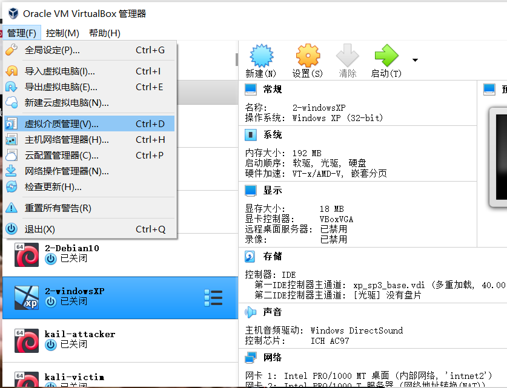

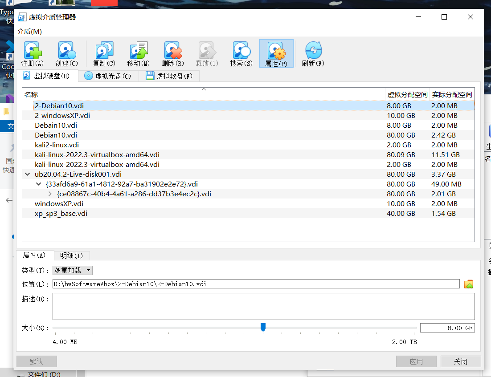

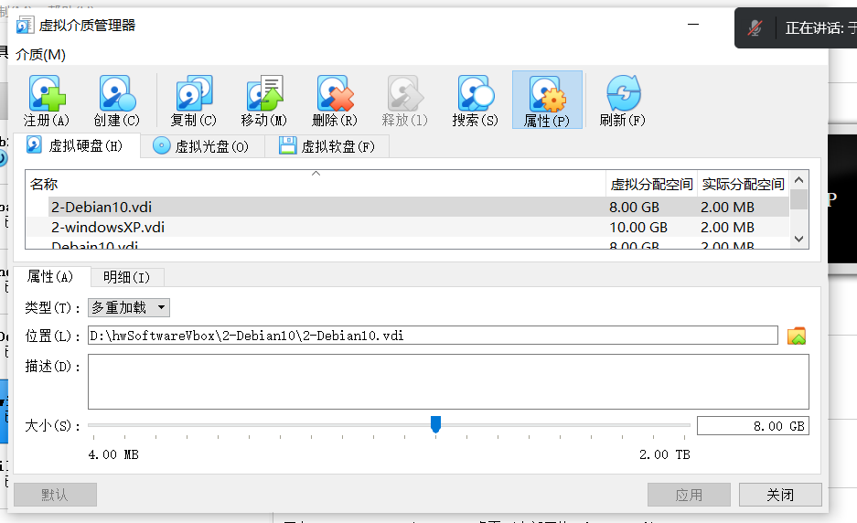


### 二、搭建虚拟机网络拓扑

#### 1、打开每台虚拟机，在设置中进行网卡的配置

##### （1）**Gateway网关**网卡配置（4块）

- 第一块：NAT网络；
- 第二块：主机（Host-Only）网络；
- 第三块：内部网络intnet1，搭建局域网1；
- 第三块：内部网络intnet2，搭建局域网2。
- 在此界面对网卡进行依次设置，如下所示

| 虚拟机名称    | 作用   |
| ------------- | ------ |
| Debian10      | 网关   |
| kali-attacker | 攻击者 |
| windowsXP     | 靶机   |
| 2-windowsXP   | 靶机   |
| 2-Debian10    | 靶机   |
| kali-victim   | 靶机   |

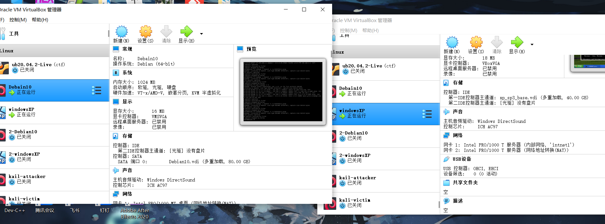

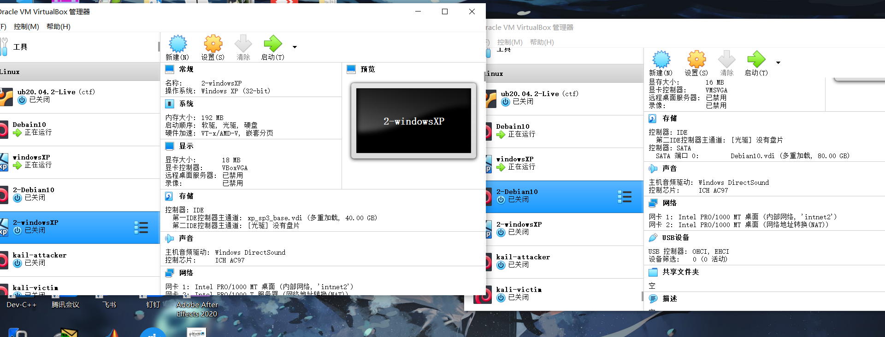

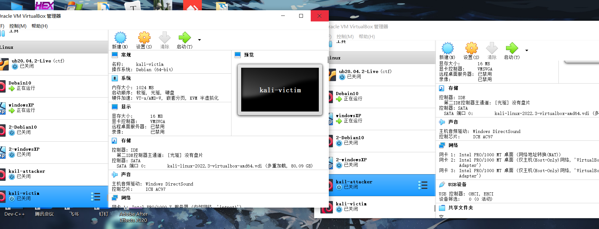

##### （2）**Attacker攻击者**需三块网卡

- 第一块：NAT网络；
- 第二块：主机（Host-Only）网络；
- 第三块：主机（Host-Only）网络；**与第二块不一样**，具体配置见图；

- **其他的实验靶机**都只需要一块网卡
  - 分为两组，使得不同的实验受害主机在不同的局域网里；
  - Windows xp1 与 kali 2号在第一局域网（intnet1）； 
  - Windows xp2 与 debian 2号在第二局域网（intnet2）；

### 三、完成以下网络连通性测试

#### 1、靶机可以直接访问攻击者主机

##### （1）测试局域网1内的主机与Attacker的连通性

- 靶机可直接访问Attacker

  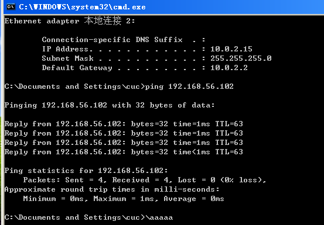

##### （2）测试局域网2内的主机与Attacker的连通性

- 靶机可直接访问Attacker

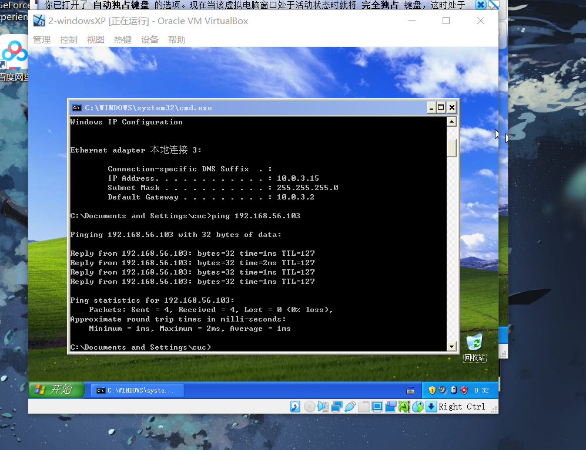


#### 2、攻击者主机无法直接访问靶机

##### （1）测试局域网1内的主机与Attacker的连通性

- Attacker不可直接访问靶机

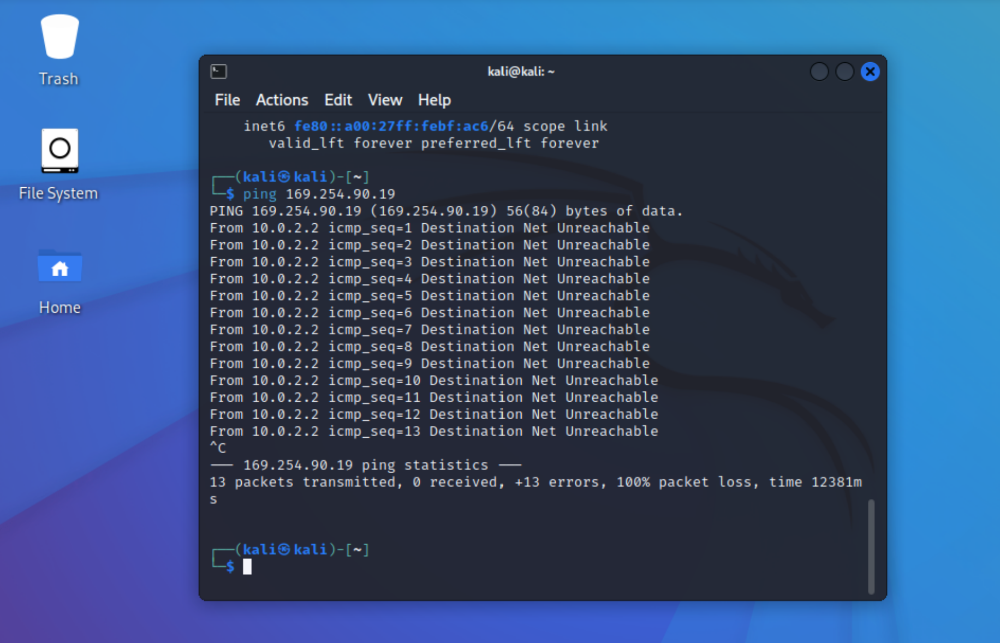


##### （2）测试**局域网2内的主机与Attacker的连通性

- Attacker不可直接访问靶机

  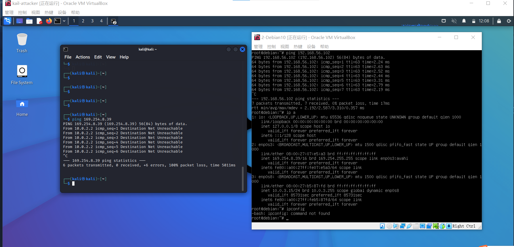

#### 3、网关可以直接访问攻击者主机和靶机

##### （1）网关访问Attacker

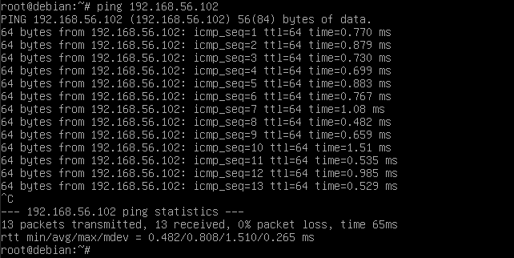

##### （2）网关访问局域网1靶机

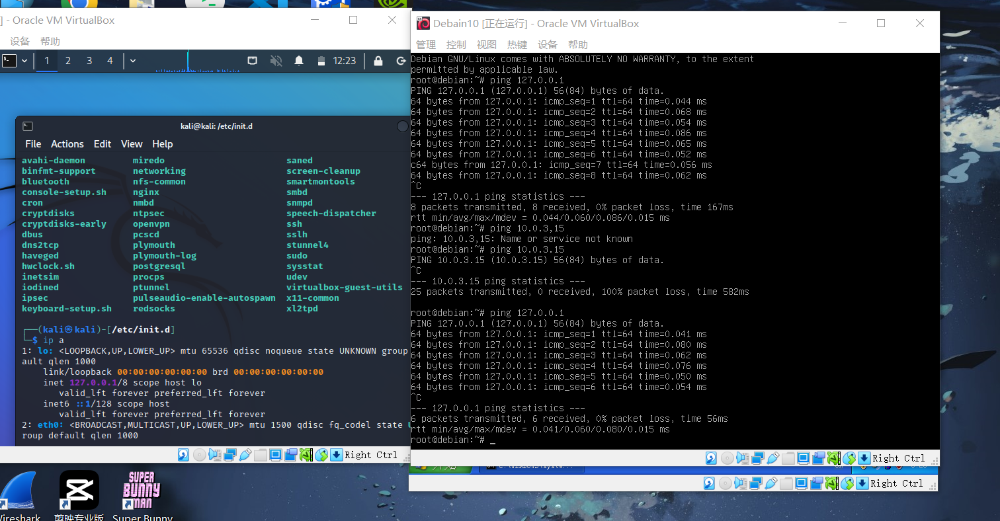

##### （3）网关访问局域网2靶机

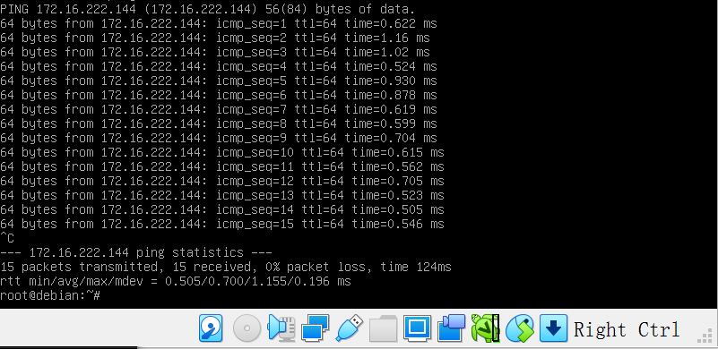

### 4.靶机的所有对外上下行流量必须经过网关

让靶机与互联网进行互通，在互通的过程中用网关进行抓包，如果靶机发送的所有包都能被网关抓到，则说明靶机的所有对外上下行流量必须经过网关。

##### （1）局域网1靶机

- 连接上互联网并用网关抓包

- 抓包语句：

  ```bash
  sudo tcpdump -c 5
  ```

- 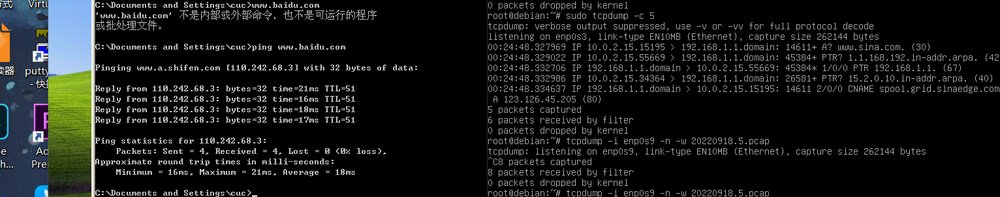

##### （2）局域网2靶机

- 联通互联网并用网关抓包

  ```bash
  sudo tcpdump -c 5
  ```

- 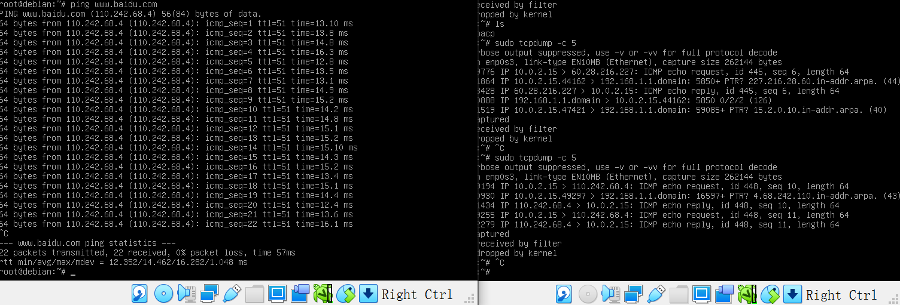

##### （3）抓包数据文件复制到主机用WireShark分析，发现是可以对上的，也就是说靶机所有上过流量必须经过网关。

首先用winscp连接上对应主机，然后就可以直接把虚拟机里的文件下载到本地上。

```bash
# 安装tcpdump
apt install tcpdump
apt update && apt install tmux

# 抓包
cd workspace
tcpdump -i enp0s9 -n -w 20220918.5.pcap

ping www.baidu.com
```

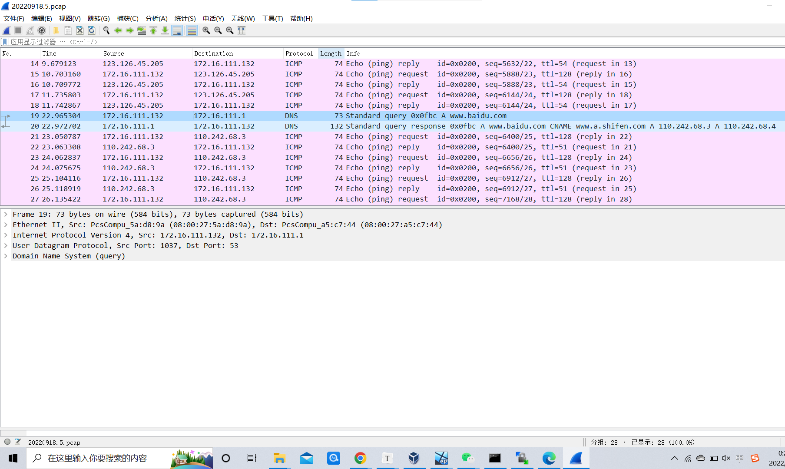

### 5.所有节点均可以访问互联网

##### （1）Attacker可正常访问互联网

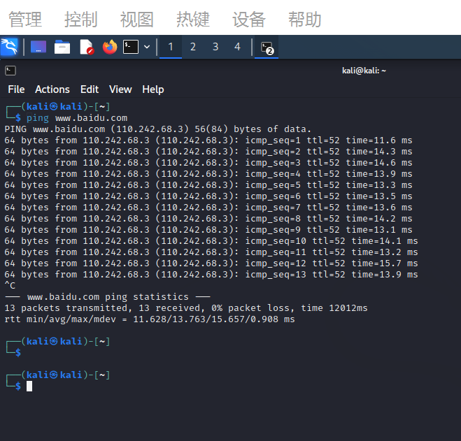

##### （2）局域网1靶机可正常访问互联网

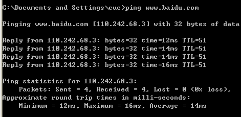

##### （3）局域网2靶机可正常访问互联网

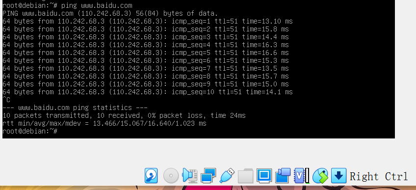

##### （4）网关可正常访问互联网

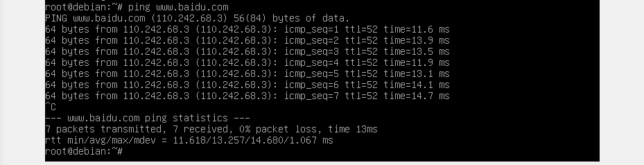


## 实验遇到的问题与解决方案

（1）导入虚拟机后的存储里面。需要有SATA这个控制器，这个可以后期添加，不然会报一些奇怪的错。

（2）如果虚拟机打不开还是出错，请删除它重新导入，不要犹豫。

（3）ping的时候本该连通，但是如果ping不通，可以考虑是防火墙没有关闭的原因，关闭防火墙即可。

```bash
#安装ufw
apt-get install ufw

#查看防火墙现有规则：
ufw status

#开启/关闭防火墙：
ufw enable  #开启
ufw disable #关闭
```

（4）抓包后想把文件导出，并用wireshark查看时会报错，反复尝试过scp,vscode,winscp后依旧会报错，具体如下。

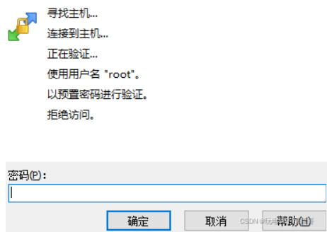

```
【更改密码】：

1.vim /etc/ssh/sshd_config

文件中PermitEmptyPasswords no改成yes

重启服务
service ssh restart

2.更改密码
sudo passwd root

3.核对密码再次登录
```

```
【更改文件配置】

#PermitRootLogin yes
#允许root登录，设为yes。
#PermitRootLogin prohibit-password 
#允许root登录，但是禁止root用密码登录
#很明显这行是需要被注释掉的！！！

#sudo vim /etc/ssh/sshd_config

找到并用#注释掉这行：PermitRootLogin prohibit-password

新建一行 添加：PermitRootLogin yes

重启服务

#sudo service ssh restart
```

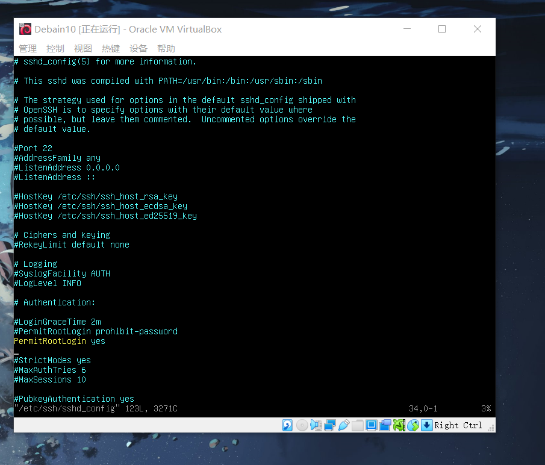

然后就可以啦！就是因为它不允许root访问所以造成的连接不上，只要把root对应的权限关了就行。

(5)靶机的ip连不上或者查不出来

- 配置两块不同的Host-only网卡

  管理->主机网络管理器->创建一个新的host-only网卡并启用DHCP服务

- 修改配置文件 。添加以下信息，将`eth1`和`eth2`这两块网卡修改为**开机自启动**，并且**写入dhcp服务**从而动态获取路由分配的ip。

```bash
sudo vim /etc/network/interfaces

auto eth1 
iface eth1 inet dhcp #配置eth1使用DHCP协议
auto eth2
iface eth2 inet dhcp #配置eth2使用DHCP协议

# 重启网卡，右上角会出现断开网络的图标
/etc/init.d/network-manager restart
```

- 然后重启虚拟机，等待一会就能查出来了。


## 参考链接

- [网卡配置](https://blog.csdn.net/hexf9632/article/details/110197530)
- [virtual box安装Linux系统并关闭防火墙](https://mbd.baidu.com/ma/s/nShWHTqN)
- [如何在Debian上更改root密码？](https://qastack.cn/unix/10095/how-do-you-change-the-root-password-on-debian)
- [WinSCP 以预设密码进行验证 拒绝访问](https://blog.csdn.net/weixin_42672685/article/details/123824826)
- [winSCP以预置密码进行验证](https://www.codeleading.com/article/11643563991/)
- [关于拒绝用户访问](https://www.cnblogs.com/miaodi/p/6718950.html)


