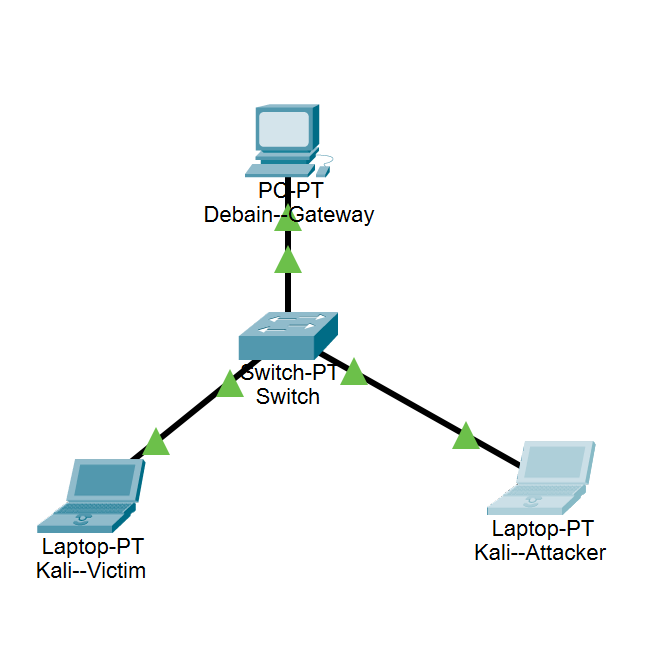

# 基于 Scapy 编写端口扫描器

## 实验目的

- 掌握网络扫描之端口状态探测的基本原理


## 实验要求

- [x] 禁止探测互联网上的 IP ，严格遵守网络安全相关法律法规
- [x] 完成以下扫描技术的编程实现
  - [x] `TCP connect scan`/ `TCP stealth scan`
  - [x] `TCP Xmas scan` / `TCP fin scan`/ `TCP null scan`
  - [x] `UDP scan`
- [x] 上述每种扫描技术的实现测试均需要测试端口状态为：开放、关闭 和 过滤 状态时的程序执行结果
- [x] 提供每一次扫描测试的抓包结果并分析与课本中的扫描方法原理是否相符？如果不同，试分析原因；
- [x] 在实验报告中详细说明实验网络环境拓扑、被测试 IP 的端口状态是如何模拟的

  

## 实验环境

- Visual Studio Code

- Scapy 2.4.4

- Kali Rolling (Linux kali 5.18.0-kali5-amd64)

  

## 实验步骤

### 网络拓扑

Attacker作为扫描端（攻击者），Victim作为被扫描的靶机（受害者），Gateway作为网关，起到联通作用。



### 端口状态模拟

查看当前防火墙的状态和现有规则

```bash
sudo ufw status
```

有以下三种状态

- 关闭状态：对应端口没有开启监听, 防火墙没有开启。

  ```bash
  sudo ufw disable
  sudo systemctl stop apache2 # port 80
  sudo systemctl stop dnsmasq # port 53
  ```

- 开启状态：对应端口开启监听: apache2基于TCP, 在80端口提供服务; DNS服务基于UDP,在53端口提供服务。防火墙处于关闭状态。

  ```shell
  sudo systemctl start apache2 # port 80
  sudo systemctl start dnsmasq # port 53
  ```

- 过滤状态：对应端口开启监听, 防火墙开启。

  ```bash
  ufw enable && ufw deny 80/tcp
  ufw enable && ufw deny 53/udp
  
  sudo ufw enable && sudo ufw deny 80/tcp && sudo ufw status #打开防火墙并且查看其状态
  ```


### TCP connect scan

TCP connect Scan(TCP连接扫描，或者TCP全连接扫描）。它是最简单的一种扫描技术，利用的是TCP协议的3次握手过程。

它直接连到目标端口并完成一个完整的3次握手过程(SYN、SYN/ACK、ACK)。操作系统提供的“connect()”函数完成系统调用,用来与目标计算机的端口进行连接。如果端口处于侦听状态,那么“connect()”函数就能成功。否则,这个端口是不能用的,即没有提供服务。先发送一个S，然后等待回应。如果有回应且标识为RA，说明目标端口处于关闭状态；如果有回应且标识为SA，说明目标端口处于开放状态。这时TCP connect scan会回复一个RA，在完成三次握手的同时断开连接。

这项技术最大的优点是，你勿需root权限。任何UNIX用户都可以自由使用这个系统调用。这种扫描很容易被检测到，在目标主机的日志中会记录大批的连接请求以及错误信息。

#### **【CODE】**

```python
from scapy.all import * #引入sys 和scapy两个模块


def tcpconnect(dst_ip, dst_port, timeout=10):
    pkts = sr1(IP(dst=dst_ip)/TCP(dport=dst_port,flags="S"),timeout=timeout) #构建TCP数据包，“S”是全开扫描
    if pkts is None:
        print("Filtered")
    elif(pkts.haslayer(TCP)):  #返回数据包如果是TCP包
        if(pkts.getlayer(TCP).flags == 0x12):  #Flags: 0x012 (SYN, ACK)，flags==0x12代表返回的是SYN+ACK数据包
            send_rst = sr(IP(dst=dst_ip)/TCP(dport=dst_port,flags="AR"),timeout=timeout)
            print("Open")
        elif (pkts.getlayer(TCP).flags == 0x14):  
            #Flags: 0x014 (RST, ACK)，flags==0x12代表返回的是reset数据包,对方拒绝建立连接
            print("Closed")

tcpconnect('10.0.2.6', 80)
```

#### 端口关闭

##### attacker端代码

```shell
sudo python tcp-connect-scan.py #运行python文件
```


##### victim代码

```shell
sudo ufw status #检查防火墙状态，此处需要关闭
sudo netstat -anop | grep LISTEN | grep -v unix #查看TCP端口是否开启，此处需要关闭
sudo tcpdump -i eth3 -w tcp-cnt-scan.pcap && date -R #开启抓包
sudo tshark -r tcp-cnt-scan.pcap -Y "tcp or udp or icmp" #进行抓包分析
```


#### 端口开放

##### attacker端代码

```shell
sudo python tcp-connect-scan.py #运行python文件
```


##### victim代码

```shell
systemctl start apache2 #打开TCP80监听端口
sudo ufw status #查看防火墙状态，此处状态需要关闭
sudo netstat -anop | grep LISTEN | grep -v unix #查看TCP端口是否开启，此处需要关闭
sudo tcpdump -i eth3 -w tcp-cnt-scan.pcap && date -R #开启抓包
sudo tshark -r tcp-cnt-scan.pcap -Y "tcp or udp or icmp" #进行抓包分析
```


#### 端口过滤

##### attacker端代码

```shell
sudo python tcp-connect-scan.py #运行python文件
```


##### victim代码

```shell
sudo ufw enable && sudo ufw deny 80/tcp && sudo ufw status #打开防火墙并且查看其状态
systemctl start apache2 # port 80，打开80端口
sudo netstat -anop | grep LISTEN | grep -v unix #查看TCP端口是否开启，此处需要关闭
sudo tcpdump -i eth3 -w tcp-cnt-scan.pcap && date -R #开启抓包
sudo tshark -r tcp-cnt-scan.pcap -Y "tcp or udp or icmp" #进行抓包分析
```


### TCP stealth scan

首先发送一个S，然后等待回应。如果有回应且标识为RA，则说明目标端口处于关闭状态；如果有回应且标识为SA，说明目标端口处于开放状态。这时TCP stealth scan只回复一个R，不完成三次握手，直接取消建立连接。

#### **【CODE】**

```python
#! /usr/bin/python

from scapy.all import *


def tcpstealthscan(dst_ip, dst_port, timeout=10):
    pkts = sr1(IP(dst=dst_ip)/TCP(dport=dst_port, flags="S"), timeout=10)
    if (pkts is None):
        print("Filtered")
    elif(pkts.haslayer(TCP)):
        if(pkts.getlayer(TCP).flags == 0x12):
            send_rst = sr(IP(dst=dst_ip) /
                          TCP(dport=dst_port, flags="R"), timeout=10)
            print("Open")
        elif (pkts.getlayer(TCP).flags == 0x14):
            print("Closed")
        elif(pkts.haslayer(ICMP)):
            if(int(pkts.getlayer(ICMP).type) == 3 and int(stealth_scan_resp.getlayer(ICMP).code) in [1, 2, 3, 9, 10, 13]):
                print("Filtered")


tcpstealthscan('10.0.2.6', 80)
```

#### 端口关闭

##### attacker端代码

```bash
cd /home/kali/Desktop/code
sudo python tcp-stealth-scan.py
```


##### victim代码

```shell
sudo netstat -anop | grep LISTEN | grep -v unix
sudo tcpdump -i eth3 -w tcp-cnt-scan.pcap && date -R
sudo tshark -r tcp-cnt-scan.pcap -Y "tcp or udp or icmp"
```


#### 端口开放

##### attacker端代码

```shell
sudo python tcp-stealth-scan.py
```


##### victim代码

```shell
sudo ufw status
sudo netstat -anop | grep LISTEN | grep -v unix
sudo tcpdump -i eth3 -w tcp-cnt-scan.pcap && date -R
sudo tshark -r tcp-cnt-scan.pcap -Y "tcp or udp or icmp"
```


#### 端口过滤

##### attacker端代码

```shell
sudo python tcp-stealth-scan.py
```


##### victim代码

```shell
sudo ufw enable && sudo ufw deny 80/tcp && sudo ufw status
sudo netstat -anop | grep LISTEN | grep -v unix
sudo tcpdump -i eth3 -w tcp-cnt-scan.pcap && date -R
sudo tshark -r tcp-cnt-scan.pcap -Y "tcp or udp or icmp"
```


### TCP Xmas scan

其原理在于TCP连接结束时,会向TCP端口发送一个设置了FIN 位的连接终止数据报,关闭的端口会回应一个设置了RST的连接复位数据报;而开放的端口则会对这种可疑的数据报不加理睬,将它丢弃。一种隐蔽性扫描，当处于端口处于关闭状态时，会回复一个RST包；其余所有状态都将不回复。

#### **【CODE】**

```python
#! /usr/bin/python
from scapy.all import *


def Xmasscan(dst_ip, dst_port, timeout=10):
    pkts = sr1(IP(dst=dst_ip)/TCP(dport=dst_port, flags="FPU"), timeout=10)
    if (pkts is None):
        print("Open|Filtered")
    elif(pkts.haslayer(TCP)):
        if(pkts.getlayer(TCP).flags == 0x14):
            print("Closed")
    elif(pkts.haslayer(ICMP)):
        if(int(pkts.getlayer(ICMP).type) == 3 and int(pkts.getlayer(ICMP).code) in [1, 2, 3, 9, 10, 13]):
            print("Filtered")


Xmasscan('10.0.2.6', 80)
```

#### 端口关闭

##### attacker端代码

```shell
sudo python tcp-xmas-scan.py
```


##### victim代码

```shell
sudo ufw status
sudo netstat -anop | grep LISTEN | grep -v unix
sudo tcpdump -i eth3 -w tcp-cnt-scan.pcap && date -R
sudo tshark -r tcp-cnt-scan.pcap -Y "tcp or udp or icmp"
```


#### 端口开放

##### attacker端代码

```shell
sudo python tcp-xmas-scan.py
```


##### victim代码

```shell
systemctl start apache2
sudo ufw status
sudo netstat -anop | grep LISTEN | grep -v unix
sudo tcpdump -i eth3 -w tcp-cnt-2.pcap && date -R
sudo tshark -r tcp-cnt-scan.pcap -Y "tcp or udp or icmp"
```


#### 端口过滤

##### attacker端代码

```shell
sudo python tcp-xmas-scan.py
```


##### victim代码

```shell
sudo ufw enable && sudo ufw deny 80/tcp && sudo ufw status
sudo netstat -anop | grep LISTEN | grep -v unix
sudo tcpdump -i eth3 -w tcp-cnt-scan.pcap && date -R
sudo tshark -r tcp-cnt-scan.pcap -Y "tcp or udp or icmp"
```


### TCP FIN scan

TCP FIN扫描也和TCP SYN扫描原理差不多，当申请方主机向目标主机一个端口发送的TCP标志位FIN置位的数据包，如果目标主机该端口是“关”状态，则返回一个TCP RST数据包；否则不回复。根据这一原理可以判断对方端口是处于“开”还是“关”状态。这种方法的缺点是，该原理不是协议规定，因而与具体的协议系统实现有一定的关系，因为有些系统在实现的时候，不管端口是处于“开”还是“关”状态，都会回复RST数据包，从而导致此方法失效。只发送FIN包，FIN数据包能够通过只监测SYN包的包过滤器，隐蔽性较SYN扫描更⾼，此扫描与Xmas扫描也较为相似，只是发送的包未FIN包，同理，收到RST包说明端口处于关闭状态；反之说明为开启/过滤状态。

#### **【CODE】**

```python
#! /usr/bin/python
from scapy.all import *


def finscan(dst_ip, dst_port, timeout=10):
    pkts = sr1(IP(dst=dst_ip)/TCP(dport=dst_port, flags="F"), timeout=10)
    if (pkts is None):
        print("Open|Filtered")
    elif(pkts.haslayer(TCP)):
        if(pkts.getlayer(TCP).flags == 0x14):
            print("Closed")
    elif(pkts.haslayer(ICMP)):
        if(int(pkts.getlayer(ICMP).type) == 3 and int(pkts.getlayer(ICMP).code) in [1, 2, 3, 9, 10, 13]):
            print("Filtered")


finscan('10.0.2.6', 80)
```

#### 端口关闭

##### attacker端代码

```shell
sudo python tcp-fin-scan.py
```


##### victim代码

```shell
sudo ufw status
sudo netstat -anop | grep LISTEN | grep -v unix
sudo tcpdump -i eth3 -w tcp-cnt-scan.pcap && date -R
sudo tshark -r tcp-cnt-scan.pcap -Y "tcp or udp or icmp"
```


#### 端口开放

##### attacker端代码

```shell
sudo python tcp-fin-scan.py
```


##### victim代码

```shell
systemctl start apache2
sudo ufw status
sudo netstat -anop | grep LISTEN | grep -v unix
sudo tcpdump -i eth3 -w tcp-cnt-scan.pcap && date -R
sudo tshark -r tcp-cnt-scan.pcap -Y "tcp or udp or icmp"
```


#### 端口过滤

##### attacker端代码

```shell
sudo python tcp-fin-scan.py
```


##### victim代码

```shell
sudo ufw enable && sudo ufw deny 80/tcp && sudo ufw status
sudo netstat -anop | grep LISTEN | grep -v unix
sudo tcpdump -i eth3 -w tcp-cnt-scan.pcap && date -R
sudo tshark -r tcp-cnt-scan.pcap -Y "tcp or udp or icmp"
```


### TCP NULL scan

其原理是扫描主机向目标主机某端口发送一个带有FIN标志的数据包,如果目标主机端口未开,则会回应一个RST的连接复位数据报;而开放的端口则会对这种可疑的数据报不加理睬,将它丢弃。因此可以根据是否收到RST数据报来判断对方的端口是否开放。发送的包中关闭所有TCP报⽂头标记，实验结果预期还是同理：收到RST包说明端口为关闭状态，未收到包即为开启/过滤状态.

#### **【CODE】**

```python
#! /usr/bin/python
from scapy.all import *


def nullscan(dst_ip, dst_port, timeout=10):
    pkts = sr1(IP(dst=dst_ip)/TCP(dport=dst_port, flags=""), timeout=10)
    if (pkts is None):
        print("Open|Filtered")
    elif(pkts.haslayer(TCP)):
        if(pkts.getlayer(TCP).flags == 0x14):
            print("Closed")
    elif(pkts.haslayer(ICMP)):
        if(int(pkts.getlayer(ICMP).type) == 3 and int(pkts.getlayer(ICMP).code) in [1, 2, 3, 9, 10, 13]):
            print("Filtered")


nullscan('10.0.2.6', 80)
```

#### 端口关闭

##### attacker端代码

```shell
sudo python tcp-null-scan.py
```


##### victim代码

```shell
sudo ufw status
sudo netstat -anop | grep LISTEN | grep -v unix
sudo tcpdump -i eth3 -w tcp-cnt-scan.pcap && date -R
sudo tshark -r tcp-cnt-scan.pcap -Y "tcp or udp or icmp"
```


#### 端口开放

##### attacker端代码

```shell
sudo python tcp-null-scan.py
```


##### victim代码

```shell
systemctl start apache2
sudo ufw status
sudo netstat -anop | grep LISTEN | grep -v unix
sudo tcpdump -i eth3 -w tcp-cnt-scan.pcap && date -R
sudo tshark -r tcp-cnt-scan.pcap -Y "tcp or udp or icmp"
```


#### 端口过滤

##### attacker端代码

```shell
sudo python tcp-null-scan.py
```


##### victim代码

```shell
sudo ufw enable && sudo ufw deny 80/tcp && sudo ufw status
sudo netstat -anop | grep LISTEN | grep -v unix
sudo tcpdump -i eth3 -w tcp-cnt-scan.pcap && date -R
sudo tshark -r tcp-cnt-scan.pcap -Y "tcp or udp or icmp"
```


### UDP scan

udp端口扫描原理 由于UDP协议是非面向连接的,对UDP端口的探测也就不可能像TCP端口的探测那样依赖于连接建立过程(不能使用telnet这种tcp协议类型命令),这也使得UDP端口扫描的可靠性不高。这是一种开放式扫描，通过发送UDP包进行扫描。当收到UDP回复时，该端口为开启状态；否则即为关闭/过滤状态.

#### **【CODE】**

```python
from scapy.all import *
def udpscan(dst_ip, dst_port, dst_timeout=10):
    resp = sr1(IP(dst=dst_ip)/UDP(dport=dst_port), timeout=dst_timeout)
    if (resp is None):
        print("Open|Filtered")
    elif (resp.haslayer(UDP)):
        print("Open")
    elif(resp.haslayer(ICMP)):
        if(int(resp.getlayer(ICMP).type) == 3 and int(resp.getlayer(ICMP).code) == 3):
            print("Closed")
        elif(int(resp.getlayer(ICMP).type) == 3 and int(resp.getlayer(ICMP).code) in [1, 2, 9, 10, 13]):
            print("Filtered")
        elif(resp.haslayer(IP) and resp.getlayer(IP).proto == IP_PROTOS.udp):
            print("Open")
udpscan('10.0.2.6', 53)
```

#### 端口关闭

##### attacker端代码

```shell
sudo python udp_scan.py
```


##### victim代码

```shell
sudo ufw status
sudo netstat -anop | grep LISTEN | grep -v unix
sudo tcpdump -i eth3 -w udp-closed.pcap && date -R
sudo tshark -r udp-closed.pcap -Y "tcp or udp or icmp"
```


#### 端口开放

##### attacker端代码

```shell
sudo python udp_scan.py
```


##### victim代码

```shell
systemctl start apache2
sudo ufw status
sudo netstat -anop | grep LISTEN | grep -v unix
sudo tcpdump -i eth3 -w udp-open.pcap && date -R
sudo tshark -r udp-open.pcap -Y "tcp or udp or icmp"
```


#### 端口过滤

##### attacker端代码

```shell
sudo python udp_scan.py
```


##### victim代码

```shell
sudo ufw enable && sudo ufw deny 80/tcp && sudo ufw status
sudo netstat -anop | grep LISTEN | grep -v unix
sudo tcpdump -i eth3 -w udp-filtered.pcap && date -R
sudo tshark -r udp-filtered.pcap -Y "tcp or udp or icmp"
```


## 课堂问题

- 提供每一次扫描测试的抓包结果并分析与课本中的扫描方法原理是否相符？如果不同，试分析原因；

  答：完全相符

- 抓包以截图形式提供在每次扫描结果中。

- 扫描方式与端口状态的对应关系

  - | 扫描方式/端口状态             | 开放                            | 关闭            | 过滤            |
    | ----------------------------- | ------------------------------- | --------------- | --------------- |
    | TCP connect / TCP stealth     | 完整的三次握手，能抓到ACK&RST包 | 只收到一个RST包 | 收不到任何TCP包 |
    | TCP Xmas / TCP FIN / TCP NULL | 收不到TCP回复包                 | 收到一个RST包   | 收不到TCP回复包 |
    | UDP                           | 收到UDP回复包                   | 收不到UDP回复包 | 收不到UDP回复包 |


## 实验问题

1.因为apache2开机没有设置自启动，所以导致80端口没开启(因为再次开机了一遍)，导致端口启动那个需要再次输入一遍；这里是根据以下命令可以发现是没有开启80端口的，就是可以看到80对应的端口是个close状态）

```bash
sudo netstat -anop | grep LISTEN | grep -v unix
```

2.因为其实需要两个主机都能互相ping通，才能完成之后的发包抓包工作(根据代码可以看出来)，不然就只能是0 packet 就是抓不到包。

3.两个主机都要设置成nat网络，不然也是互相ping不成功的。


## 参考资料

- [使用python中scapy 实施TCP 全开扫描](https://blog.csdn.net/weixin_54783024/article/details/121521981)
- [【推荐阅读】TCP常见的扫描类型](https://blog.51cto.com/professor/1701977)
- [什么是 TCP connect 扫描](https://zhidao.baidu.com/question/5992827.html)
- [10.0.2.15ip地址——VirtualBox安装Lunix系统ip地址的问题](https://blog.csdn.net/u014581901/article/details/77771505)
- [Virtualbox网络连接方式选择NAT网络，无法指定界面名称的解决方法](https://blog.csdn.net/hexf9632/article/details/110197530)
- [TCP FIN, NULL, and Xmas Scans (-sF, -sN, -sX) | Nmap Network Scanning](https://nmap.org/book/scan-methods-null-fin-xmas-scan.html)

