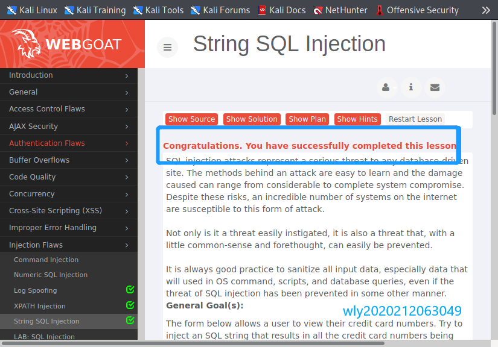

# 实验七 Web应用漏洞攻防

## 【实验目的】

- 了解常见 Web 漏洞训练平台
- 了解常见 Web 漏洞的基本原理
- 掌握 OWASP Top 10 及常见 Web 高危漏洞的漏洞检测、漏洞利用和漏洞修复方法


## 【实验环境】

- WebGoat
- Juice Shop
- kali虚拟机


## 【实验要求】

- [x] 每个实验环境完成不少于 **5** 种不同漏洞类型的漏洞利用练习 
- [ ] （可选）使用不同于官方教程中的漏洞利用方法完成目标漏洞利用练习 
- [ ] （可选）**最大化** 漏洞利用效果实验
- [ ] （可选）编写 **自动化** 漏洞利用脚本完成指定的训练项目
- [ ] （可选）定位缺陷代码
- [ ] （可选）尝试从源代码层面修复漏洞


## 【实验过程】

#### 1.docker 安装

（1）根据老师所给课本上的安装步骤，逐步进行操作

```bash
lsb_release -a
# No LSB modules are available.
# Distributor ID: Kali
# Description:    Kali GNU/Linux Rolling
# Release:        2019.2
# Codename:       n/a

# 当前 Kali 版本自带的 Docker 最新版软件包名为 docker.io
apt-cache policy docker.io
# docker.io:
#   Installed: (none)
#   Candidate: 19.03.4+dfsg2-2
#   Version table:
#      19.03.4+dfsg2-2 500
#         500 http://http.kali.org/kali kali-rolling/main amd64 Packages

# Docker 官方当前使用的软件包名为 docker-ce ，但在 Kali 上没有使用这个软件包名
apt-cache policy docker-ce
# docker-ce:
#   Installed: (none)
#   Candidate: (none)
#   Version table:
```

可以看到，当前虚拟机中的`docker`是不可用的，这里有个docker报错有关的问题，会在后面写出。

（2）安装`docker-compose`


```bash
# 运行以下命令下载 Docker Compose 的当前稳定版本
sudo curl -L "https://github.com/docker/compose/releases/download/1.29.2/docker-compose-$(uname -s)-$(uname -m)" -o /usr/local/bin/docker-compose

# 对二进制文件应用可执行权限
sudo chmod +x /usr/local/bin/docker-compose

# 测试安装
docker-compose --version 
```


(3)实验环境搭建

```bash
# 一次获取所有文件（包括所有子模块管理的文件）
git clone https://github.com/c4pr1c3/ctf-games.git --recursive
cd ctf-games

# （可选）单独更新子模块
git submodule init && git submodule update

# 启动 webgoat 系列服务
cd owasp/webgoat/ && docker-compose up -d

# 启动 juice-shop 及 shake-logger 服务
cd ../../owasp/juice-shop/ && docker-compose up -d
```

- 查看配置情况：状态为`healthy`

`127.0.0.1:8087/WebGoat/login`(WebGoat7.1)可以成功登录


访问`127.0.0.1:8088/WebGoat/login`(WebGoat8.0)可以成功登录


访问`127.0.0.1:3000`(Juice Shop)可以成功登录


#### 2.WebGoat7.1

##### (1)General-HTTP Basic

- 输入框输入`webgoat`点击`GO!`,发现输入框里的内容反序变成`taogbew`,同时也已成功


##### (2)Access Control Flaws-Using an aaccess control matrix

- 根据提示判断`Larry`具有`Account manager`权限，成功


##### (3)Code Quality-discovery clues in the HTML

- 根据提示在网页源码中寻找线索，发现用户名和密码


##### (4)Insecure Storage-encoding basics

- 讲了常见的编码基础


##### (5)Injection Flaws

###### [1]**log spoofing**

- 根据题目提示下面的灰色框是日志信息，所以目的是再日志中显示`admin`身份登陆成功

- 在用户名中注入语句`%0d%0aLogin succeeded for username:admin`,成功


###### [2]**XPATH Injection**

- 在用户名处注入`' or 1=1 or 'a'='a`，成功


###### [3]**String SQL Injection**

- 输入`Smith`观察`SQL`查询语句，找到注入方法`SELECT * FROM user_data WHERE last_name = '[input]'`，通过更改`[input]`实现注入，主要是最后的那个单引号要去掉

- 查询框内输入`Smith ' or 1=1 --`，成功



#### 3.WebGoat 8.0

##### (1)General-Http Basics

根据问题找答案，问题是`POST`还是`GET`报文，`F12`查看报文，发现`POST`

寻找`magic_num`，报文参数里没有找到，网页源码搜索`magic_num`直接找到


输入`POST` 和 `80`，成功


##### (2)Authentication Flaws-Secure Passwords

密码强度问题，任意输入尽可能复杂的密码即可


##### (3)Cross-Site Scripting(XSS)-Cross Site Scripting(stored)

评论中给出了提示`calling webgoat.customjs.phoneHome()`

再评论框输入代码，`F12`查看运行结果，将其输入`submit`，任务完成


##### (4)Insecure Communication-Insecure Login

- 查看网页源码，发现提交时用了一个函数`submit_secret_credentials()`

- 检查函数的源代码

- 在线解码十六进制代码

- 得到`usernamde:CaptainJack`和`password:BlackPearl`提交成功


#### 4.Juice Shop

##### (1)Broken Access Control-Admin Section

进入商店的`administration`部分，查看网页源代码，根据`score-board`的思路，发现`path:administration`

访问`http://127.0.0.1:3000/#/administration`，登陆成功


##### (2)Cryptographic Issues-Weird Crypto

- 在页面内提交一个不安全的密码算法
- 尝试提交提交`md5`，成功


##### (3)Miscellaneous-Bully Chatbot

- 采用暴力破解的办法，从`chatbot`处获得优惠券

- 和`chatbot`聊天，不断发送`coupon code`


##### (4)XSS-Bonus Payload

- 搜索框直接搜索所给代码

- 任务完成


#### 5.Login Admin

考点：**注入** **万能密码**

使用万能密码即可登录管理员账户,即可通过

```
'or 1=1 --
```

点击登陆，电子邮箱前加一个 ’ (单引号) 即可


## 【遇到的问题】

docker 安装的时候可以看到，当前虚拟机中的`docker`是不可用的

- 【问题】按照课本中所给的单行命令来添加`docker`官方的apt镜像源地址

  ```bash
  if [[ $(grep -c "docker.com" /etc/apt/sources.list) -eq 0 ]];then echo "deb https://download.docker.com/linux/debian buster stable" >> /etc/apt/sources.list;fi
  ```

  这条命令运行时会报错

  ```bash
  zsh: parse error near `then'
  ```

  没有找到问题

- 尝试直接用`vim`打开`/etc/apt/sources.list`添加镜像源地址

  ```bash
  sudo vim /etc/apt/sources.list
  ```

- 添加`docker`官方的GPG公钥到系统受信任的公钥数据库

  ```bash
  curl -fsSL https://download.docker.com/linux/debian/gpg | sudo apt-key add -
  apt update
  ```

- 此时再执行 `apt-cache policy docker-ce` 就能看到是由 `Docker` 官方 apt 镜像源提供的最新 `Docker` 社区稳定版了


## 【参考资料】

[电子课本](https://c4pr1c3.github.io/cuc-ns/chap0x07/exp.html)

[OWASP’s Juice Shop 题解](https://www.freebuf.com/articles/web/255837.html)

[webgoat全关教程手册](https://blog.csdn.net/zy15667076526/article/details/109560492)

[漏洞攻防](https://github.com/CUCCS/2021-ns-public-Bob472/tree/chapter0x07/chapter0x07)

