# 第11次作业 常见蜜罐体验和探索

## 【实验环境】

- 【Attacker-kali】：IP:10.0.2.7


- 【Victim-kali-1】：IP:10.0.2.6


## 【实验目的】

- 了解蜜罐的分类和基本原理
- 了解不同类型蜜罐的适用场合
- 掌握常见蜜罐的搭建和使用

## 【实验要求】

- [x] 记录蜜罐的详细搭建过程
- [x] 使用`nmap`扫描搭建好的蜜罐并分析扫描结果，同时分析`nmap` 扫描期间」蜜罐上记录的信息
- [x] 如何辨别当前目标是一个蜜罐，以自己搭建的蜜罐为例说明
- [x] （可选）总结常见的蜜罐识别和检测方法
- [ ] （可选）基于`canarytokend`搭建密信实验环境进行自由探索性实验

## 【实验过程】

### 一、前期准备

##### 1、搭建网络拓扑

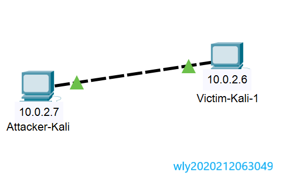

##### 2、连通性测试

```
ping 10.0.2.6
```

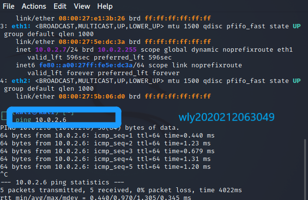

```
ping 10.0.2.7
```

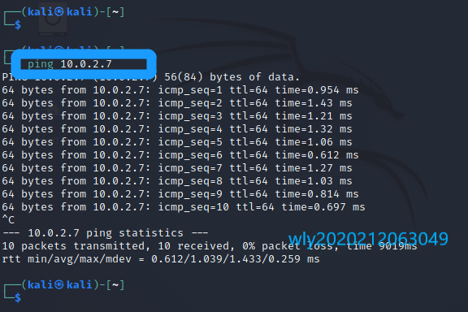

##### 3、网络测试

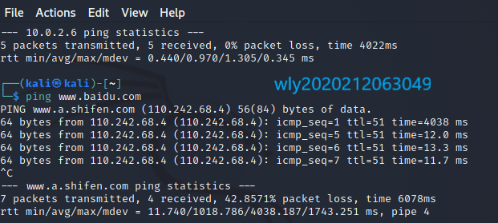

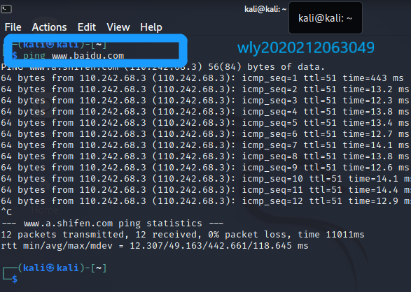

### 二、低交互蜜罐

##### 1、原理

  >`低交互蜜罐sshesame`：一个假的ssh服务器,让每个人都进入并记录他们的活动日志。一个假的ssh服务器,让每个人都进入并记录他们的活动日志。
  >
  >低交互蜜罐只会让攻击者非常**有限地访问**操作系统。“低交互”意味着，对手**无法在任何深度上与您的诱饵系统进行交互**，因为它是一个更加**静态**的环境。低交互蜜罐通常会模仿少量的互联网协议和网络服务，足以欺骗攻击者，而不是更多。通常，大多数企业都会模拟TCP和IP等协议，这使得攻击者可以认为他们正在连接到真实系统而不是蜜罐环境。

  >低交互蜜罐易于部署，不允许访问真正的root shell，也不使用大量资源进行维护。但是，低交互蜜罐可能不够有效，因为它只是机器的基本模拟。它可能不会欺骗攻击者参与攻击，而且它肯定不足以捕获复杂的威胁，如零日攻击。
  >
  >**sshesame**是一个假的SSH服务器,让每个人都进入并记录他们的活动日志。该蜜罐GitHub仓库主页上提供了安装说明，操作简单，界面也比较友好。

##### 2、下载安装sshesame

```bash
$ git clone https://github.com/jaksi/sshesame.git
$ cd sshesame 
$ go build
```

##### 3、安装docker

```shell
#安装https协议、CA证书、dirmngr
apt-get update 
apt-get install -y apt-transport-https ca-certificates
apt-get install dirmngr

#添加GPG密钥并添加更新源
curl -fsSL https://mirrors.tuna.tsinghua.edu.cn/docker-ce/linux/debian/gpg | sudo apt-key add -
echo 'deb https://mirrors.tuna.tsinghua.edu.cn/docker-ce/linux/debian/ buster stable' | sudo tee /etc/apt/sources.list.d/docker.list

#系统更新以及安装docker
apt-get update
apt install docker-ce

#启动docker服务器
service docker start

#安装compose
apt install docker-compose

#docker安装测试
docker version
```

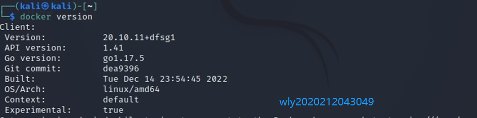

##### 4、配置docker

```shell
$ sudo docker run -it --rm\
  -p 127.0.0.1:2022:2022\
  -v sshesame-data:/data ghcr.io/jaksi/sshesame
```

##### 5、启动docker并连接蜜罐

（1）启动docker:`sudo docker run -it --rm\`

（2）连接蜜罐：`ssh -p 2022 127.0.0.1`

（3）一些简单操作

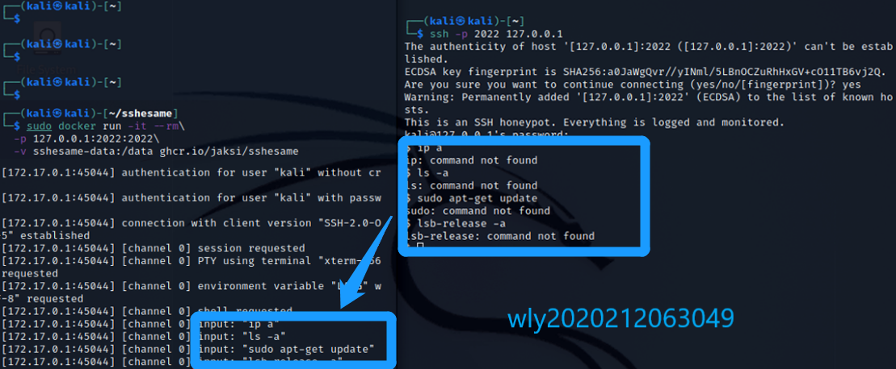

通过上述操作，我们可以看到，每一个操作都被记录，包括输入的密码。

### 三、中等交互蜜罐

  >`Cowrie`是一种中等交互的SSH和Telnet蜜罐，旨在记录暴力攻击和攻击者执行的shell交互。Cowrie还充当SSH和telnet代理，以观察攻击者对另一个系统的行为。同时也是一个模拟的 SSH 服务器。很多攻击者都是 SSH 登录，你可以把这个软件在22端口启动，真正的 SSH 服务器放在另一个端口。当别人以为攻入了服务器，其实进入的是一个虚拟系统，然后会把他们的行为全部记录下来。
  >
  >中交互蜜罐是对真正的操作系统的各种行为的模拟，它提供了更多的交互信息，同时也可以从攻击者的行为中获得更多的信息。在这个模拟行为的系统中，蜜罐此时看起来和一个真正的操作系统没有区别，它们甚至是比真正系统还诱人的攻击目标。
  >
  >选择**Cowrie**的原因：
  >
  >- cowrie是一种中等交互的SSH和Telnet蜜罐，旨在记录暴力攻击和攻击者执行的shell交互。Cowrie还充当SSH和telnet代理，以观察攻击者对另一个系统的行为。同时也是一个模拟的SSH服务器。很多攻击者都是SSH登录，你可以把这个软件在22端口启动，真正的SSH服务器放在另一个端口。当别人以为攻入了服务器，其实进入的是一个虚拟系统，然后会把他们的行为全部记录下来。

##### 1、下载cowire

```bash
git clone https://github.com/cowrie/docker-cowrie.git
cd docker-cowrie/   
docker pull cowrie/cowrie
docker run -p 2222:2222 cowrie/cowrie
```

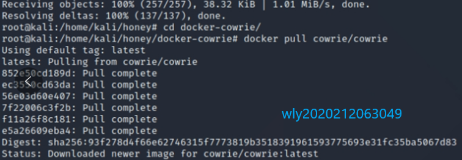

（1）nmap 扫描，发现开启的2222端口ssh -p 2222 xxx，因为只有这个端口是开放的。

（2）使用ssh登录，多试几次就能发现，使用root+任意密码都可以登录，非root无法登陆，使用 `ssh -c` 不影响结果。

（3）TEST

##### 2、`ping` 某个网址

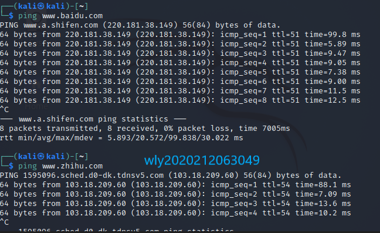

##### 3、`sudo apt update`

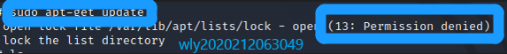

##### 4、`cat & vim`

发现异常，`vim`显示命令不存在；`cat`问题在于有`a`这个文件，但显示文件不存在

##### 5、查看蜜罐日志

```bash
 # 将日志复制到本地查看
 docker cp a0f7c7db65ab:/cowrie/cowrie-git/var/log/cowrie /home/kali
 # jq带格式高亮查看 
cat json.txt | jq '.'
```

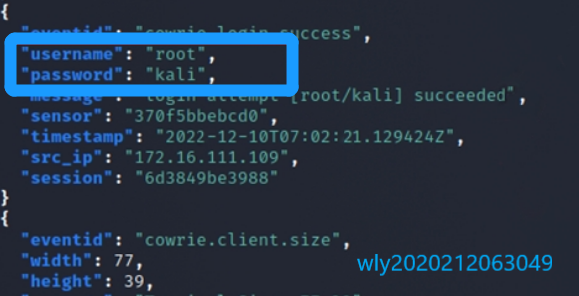

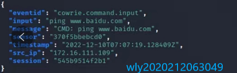


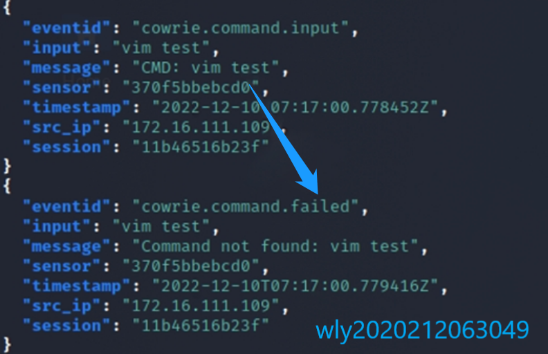

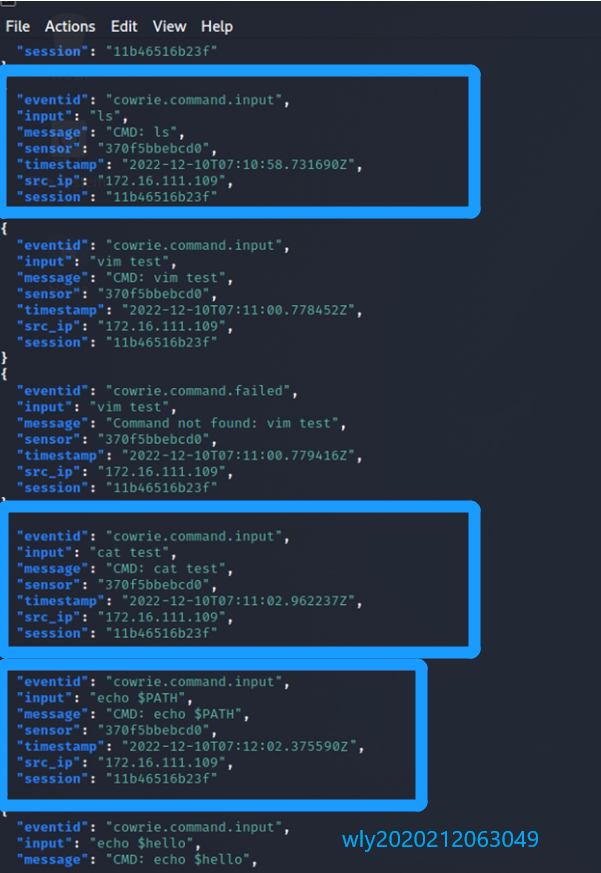


### 四、总结常见的蜜罐识别和检测方法

##### 【蜜罐识别】：

- 比较容易的识别的是低交互的蜜罐，尝试一些比较复杂且少见的操作能比较容易的识别低交互的蜜罐，主要集中在模拟技术的检测上，通常存在着较为明显的特征。
- 相对困难的是高交互蜜罐的识别，因为高交互蜜罐通常以真实系统为基础来构建，和真实系统比较近似。对这种情况，通常用虚拟机探测技术进行识别，会基于虚拟文件系统和注册表的信息、内存分配特征、硬件特征、特殊指令等来识别。
- 相关文章：
  - [知乎 - 如何判断是不是进入了蜜罐？](https://www.zhihu.com/question/31213254/answer/137153019)
  - [Is it possible to detect a honeypot?](https://security.stackexchange.com/questions/90642/is-it-possible-to-detect-a-honeypot)
  - [How to detect a HoneyPot?](https://www.ethicalhacker.net/forums/topic/how-to-detect-a-honeypot/)
  - [IEEE - Detecting honeypots and other suspicious environments](https://www.ei.ruhr-uni-bochum.de/media/emma/veroeffentlichungen/2012/08/07/Honeypots-IEEE05.pdf)


- 常规命令的检测。如本实验所用的 `echo $PATH` 等各种命令，可以上手来一套。这里不展开说明。
- 部分低交互蜜罐，如dionaea，使用nmap请求哪个端口就会开放哪个端口。
- 蜜罐攻陷的成本是非常低的。漏洞过于明显的系统值得被怀疑。
- 给web服务器发送大量http请求，导致web服务器抢占大量计算机资源用来处理请求。这样就会让蜜罐的反应慢下来。
- 数据包时间戳分析、分析低交互蜜罐产生的网络响应来寻找差异、环境不真实导致穿帮。

##### 【检测】：

- 基于内核的 Sebek 组件用于捕获 SSH 和 SSL 加密的信息，常用于高交互蜜罐系统的数据捕获工具，可以对其进行检测。检测方法：
  - 查看反应时间
  - 观察网络传输计数器
  - 修改系统调用表
  - 查找隐藏模块


## 【问题与解决】

##### 1.Docker安装问题

发现安装时报错下载不下来，然后网上查资料发现换个源就解决了。

##### 2.Go build 发生connection denined

【原因】：默认使用的是proxy.golang.org，在国内无法访问。

【解决方法】：go env -w GOPROXY=https://goproxy.cn重新执行命令，可以正常执行！

##### 3.`go`指令包无法安装

【解决办法】：[go指令安装教程](https://blog.csdn.net/andiao1218/article/details/101192874)，修改go指令包版本。


## 【参考资料】

- [Github-Cowrie](https://github.com/cowrie/cowrie)

- [GithubDot1029](https://github.com/CUCCS/2021-ns-public-Dot1029/tree/chap0x11)

- [go指令安装教程](https://blog.csdn.net/andiao1218/article/details/101192874)

- [docker cp命令详解](https://www.runoob.com/docker/docker-cp-command.html)

- [蜜罐的识别和检测](https://www.zhihu.com/question/31213254)

- [docker](https://blog.csdn.net/laughing1997/article/details/84305615)

