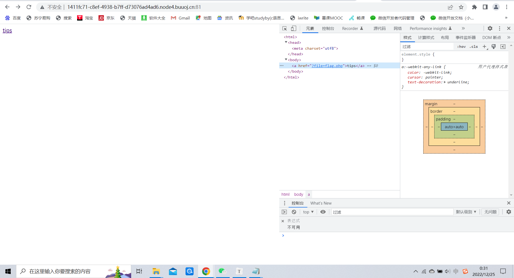
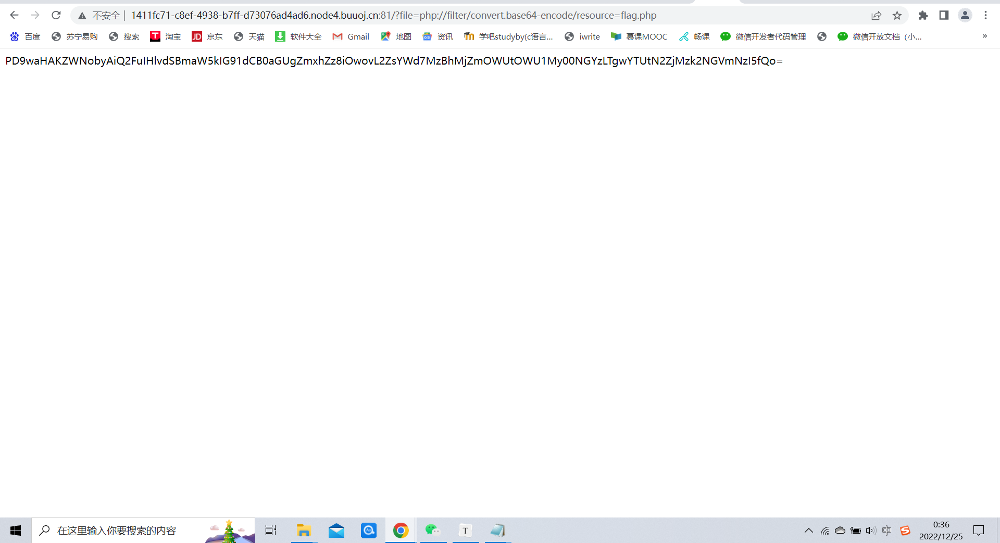
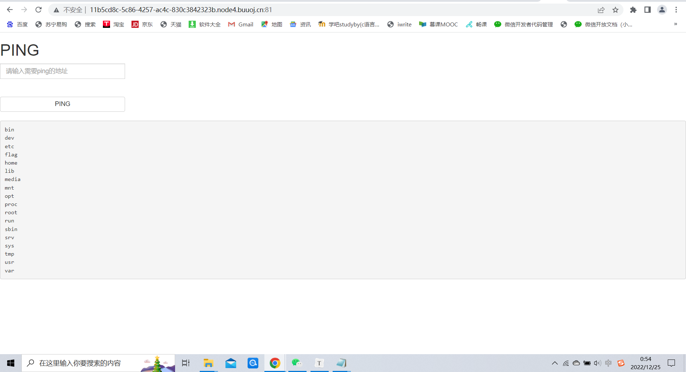
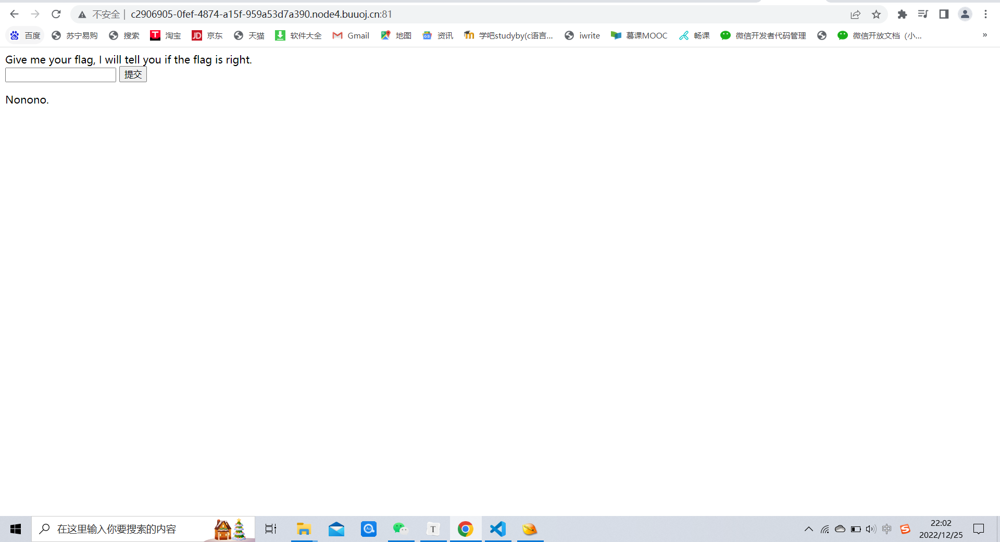
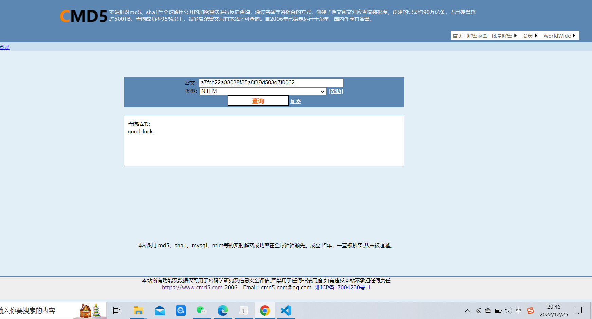

# CTF-writeup


## 一、目录清单

| 序号 | 题目名                                                       | 题目类型 | 在网站上的分值 | 时间                       | 难度级别 |
| ---- | ------------------------------------------------------------ | -------- | -------------- | -------------------------- | -------- |
| 1    | [[极客大挑战 2019\]EasySQL](https://buuoj.cn/challenges#[极客大挑战 2019]EasySQL) | Web      | 1              | 2022年12月23日晚上9点48分  | ⭐️        |
| 2    | [[HCTF 2018\]WarmUp](https://buuoj.cn/challenges#[HCTF 2018]WarmUp) | Web      | 1              | 2022年12月23日晚上10点27分 | ⭐️        |
| 3    | [[极客大挑战 2019\]Havefun](https://buuoj.cn/challenges#[极客大挑战 2019]Havefun) | Web      | 1              | 2022年12月23日晚上10点15分 | ⭐️        |
| 4    | [[ACTF2020 新生赛\]Include](https://buuoj.cn/challenges#[ACTF2020 新生赛]Include) | Web      | 1              | 2022年12月23日晚上10点35分 | ⭐️        |
| 5    | [[ACTF2020 新生赛\]Exec](https://buuoj.cn/challenges#[ACTF2020 新生赛]Exec) | Web      | 1              | 2022年12月23日晚上10点40分 | ⭐️        |
| 6    | [[SUCTF 2019\]EasySQL](https://buuoj.cn/challenges#[SUCTF 2019]EasySQL) | Web      | 1              | 2022年12月23日晚上10点54分 | ⭐️        |
| 7    | [MD5](https://buuoj.cn/challenges#MD5)                       | Crypto   | 1              | 2022年12月23日晚上9点41分  | ⭐️        |
| 8    | [Url编码](https://buuoj.cn/challenges#Url编码)               | Crypto   | 1              | 2022年12月23日晚上9点44分  | ⭐️        |
| 9    | [一眼就解密](https://buuoj.cn/challenges#一眼就解密)         | Crypto   | 1              | 2022年12月23日晚上9点36分  | ⭐️        |
| 10   | [篱笆墙的影子](https://buuoj.cn/challenges#篱笆墙的影子)     | Crypto   | 1              | 2022年12月23日晚上10点38分 | ⭐️        |
| 11   | [password](https://buuoj.cn/challenges#password)             | Crypto   | 1              | 2022年12月23日晚上10点16分 | ⭐️        |
| 12   | [摩丝](https://buuoj.cn/challenges#摩丝)                     | Crypto   | 1              | 2022年12月23日晚上10点13分 | ⭐️        |
| 13   | [变异凯撒](https://buuoj.cn/challenges#变异凯撒)             | Crypto   | 1              | 2022年12月23日晚上10点20分 | ⭐️        |
| 14   | [Quoted-printable](https://buuoj.cn/challenges#Quoted-printable) | Crypto   | 1              | 2022年12月23日晚上10点31分 | ⭐️        |
| 15   | [Rabbit](https://buuoj.cn/challenges#Rabbit)                 | Crypto   | 1              | 2022年12月23日晚上10点33分 | ⭐️        |
| 16   | [看我回旋踢](https://buuoj.cn/challenges#看我回旋踢)         | Crypto   | 1              | 2022年12月23日晚上10点05分 | ⭐️        |
| 17   | [丢失的MD5](https://buuoj.cn/challenges#丢失的MD5)           | Crypto   | 1              | 2022年12月25日晚上9点56分  | ⭐️        |
| 18   | [Windows系统密码](https://buuoj.cn/challenges#Windows系统密码) | Crypto   | 1              | 2022年12月23日晚上10点48分 | ⭐️        |
| 19   | [签到](https://buuoj.cn/challenges#签到)                     | Misc     | 1              | 2022年12月23日晚上9点30分  | ⭐️        |
| 20   | [大白](https://buuoj.cn/challenges#大白)                     | Misc     | 1              | 2022年12月23日晚上10点40分 | ⭐️        |
| 21   | [N种方法解决](https://buuoj.cn/challenges#N种方法解决)       | Misc     | 1              | 2022年12月23日晚上10点43分 | ⭐️        |


## 二、题目对应writeup

【注】：由于当时做题时没有看到写wirteup的要求，所以是整体把题做完了之后才写的writeup，所以时间可能就有所间隔QAQ


### 1.WEB

因为每个人分配的靶机网址不同，我认为有很鲜明的个人特征，所以不做处理

##### 【[极客大挑战 2019\]EasySQL】

首先点击启动靶机，得到一串网址


然后打开网址


输入万能公式1' or '1'='1试出

```bash
# 万能公式
1 and 1=1
1' and '1'='1
1 or 1=1 
1' or '1'='1
```


得到flag


##### 【[HCTF 2018]WarmUp1】

首先点击启动靶机，得到一串网址


然后打开网址


打开开发者工具进行查看


发现有个叫source.php的文件，在浏览器网址后面加上


得到如下界面：


发现还有一个叫hint.php的文件，在网址后加上


来到flag界面


发现ffffllllaaaagggg暗示应该是有四层文件结构的界面，所以在网址后加入index.php?file=hint.php?../../../../../ffffllllaaaagggg


得到flag{77868565-de07-479b-8c56-4d2d1f26be28}


##### 【[极客大挑战 2019]Havefun1】

首先点击启动靶机，得到一串网址


然后打开网址


用开发者工具进行查看


发现一段php代码，得出在网址后加入?cat=dog就可以得到flag了


得到flag{d4d6d007-390a-4391-bd34-23a2a2343967}


##### 【[ACTF2020 新生赛]Include1】

启动并访问靶机


访问链接，发现通过file伪协议，打开了flag.php这个文件，说明存在文件包含漏洞。




既然该文件名为flag.php，那么flag应该就存在于此文件中，但是我们f12并没有查看到flag，猜测flag应该是在flag.php的源代码当中
我们可以利用php://filter伪协议来查看flag.php的源代码，构造payload：?file=php://filter/convert.base64-encode/resource=flag.php


成功获取到flag.php加密后到源代码内容：`PD9waHAKZWNobyAiQ2FuIHlvdSBmaW5kIG91dCB0aGUgZmxhZz8iOwovL2ZsYWd7MzBhMjZmOWUtOWU1My00NGYzLTgwYTUtN2ZjMzk2NGVmNzI5fQo=`



将其base64解密后，成功获取到flag：`flag{30a26f9e-9e53-44f3-80a5-7fc3964ef729}`

```
<?php
echo "Can you find out the flag?";
//flag{30a26f9e-9e53-44f3-80a5-7fc3964ef729}
```


##### 【[ACTF2020 新生赛]Exec1】

首先点击启动靶机，得到一串网址


然后打开网址


试着用ls命令找出文件


找到正确路径




然后读出flag里面的内容


得到`flag{7a17342d-6339-4d7b-be7c-74ec930d1620}`


##### 【[SUCTF 2019]EasySQL1】

1.首先点击启动靶机，得到一串网址


然后打开网址


输入`' union select 1,2;#`判断一下字符个数，发现提示nonono，又尝试了`' order by 2;#`也不行，应该是后台对部分关键字做了过滤



2.随便输入一个数字后，发现有了回显，而且无论输入什么数字，都回显1，猜测该系统后台代码为：`select $_POST['query'] || flag from flag` [1] ，且那么直接在1前面拼接*，即`*,1`，解得`flag{47bc9ae3-cb14-4421-b19b-181fab504095}`


### 2.Crypto

##### 【MD5】

首先将网站上对应的压缩包下载到本地进行解压，发现里面是个名叫题目.txt的文件


然后可以知道它是用MD5进行加密的，所以我们用MD5进行解密即可


得出flag{admin1}


##### 【URL】

首先将网站上对应的压缩包下载到本地进行解压，发现里面是个名叫题目.txt的文件


然后可以知道它是用URL进行加密的，所以我们用URL进行解密即可


得出flag{and 1=1}


##### 【一眼就解密】

从题干中得到通过base64加密过后的编码，将其放入base64在线解密工具，解码后得到flag


发现这是个base64编码的，解码即可


##### 【篱笆墙的影子】

将题目下载到本地并解压打开，发现是个叫篱笆墙的影子.txt的文件


题目得出是栅栏密码，可以看出该栅栏密码为两行

```bash
f l a g
e h a v
```

写出剩下的，得出`flag{wethinkwehavetheflag}`


##### 【password】

将题目下载到本地并解压打开，发现是个叫题目.txt的文件


由题干可知，key{}中有10个数，猜测flag可能是 “姓名＋生日”。张三的姓名缩写`zs`，生日是 `19900315`。因此key为`zs19900315`，从而得到`flag{zs19900315}`


##### 【摩丝】

将题目下载到本地并解压打开，发现是个叫题目.txt的文件


发现`.-`很明显是摩斯电码的形式，解密即可得出`flag{ILOVEYOU}`


##### 【变异凯撒】

将题目下载到本地并解压打开，发现是个叫变异凯撒.txt的文件


由密码学可知，凯撒加密明文中的所有字母都在字母表上向后（或向前）按照一个固定数目进行偏移后被替换成密文。

题目用普通凯撒解不出来，发现此题目的凯撒加密与移动位数相关，因为出现了特殊字符，所以字母变的范围应是ASCII码值。对照ASCII码表后可以发现第一个字符向后移了5,第二个向后移了6,第三个向后移了7，对此编写python算出`flag{Caesar_variation}`

```python
str="afZ_r9VYfScOeO_UL^RWUc"
k=5
for i in str:
print(chr(ord(i)+k),end='')
k+=1
```


##### 【Quoted-printable】

将题目下载到本地并解压打开，发现是个叫题目.txt的文件


得知该题运用的是Quoted-printable编码，解码即可


得到`flag{那你也很棒哦}`


##### 【Rabbit】

将题目下载到本地并解压打开，发现是个叫题目.txt的文件


可知该题运用的是Rabbit编码，解码即可


##### 【看我回旋踢】

将题目下载到本地并解压打开，发现是个叫题目.txt的文件


搜索发现为ROT13 编码，解密得出flag


##### 【丢失的MD5】

将题目下载到本地并解压打开，发现是个叫MD5.py的文件，用vscode将代码打开


然后运行一下

发现有报错`Unicode-objects must be encoded before hashing`，查询后发现是因为python版本问题，python3下字符串为Unicode类型，而hash传递时需要的是utf-8类型，因此，需要类型转换。(毕竟题目时间久了当时还是python2版本)

修改后如下：

```python
import hashlib   
for i in range(32,127):
    for j in range(32,127):
        for k in range(32,127):
            m=hashlib.md5()
            s='TASC'+chr(i)+'O3RJMV'+chr(j)+'WDJKX'+chr(k)+'ZM'
            m.update(str(s).encode('UTF-8'))
            des=m.hexdigest()
            if 'e9032' in des and 'da' in des and '911513' in des:
                print (des)
```

然后运行得出`flag{e9032994dabac08080091151380478a2}`


##### 【Windows系统密码】

将题目下载到本地并解压，用vscode打开，发现是个叫pass.hash的文件


发现很像md5的加密，于是就一段一段的试。在`a7fcb22a88038f35a8f39d503e7f0062`这段解码后得到了`flag{good-luck}`




### 3.Misc

##### 【签到】

直接把题目给的flag输入就行


##### 【大白】

将题目下载到本地并解压，发现是个png图片。

结合题目“看不到图？ 是不是屏幕太小了 ”可知，应该对图片进行修改，用vscode打开为二进制形式（hex editor）

打开时发现出现提示，证明图片有破损需要修复，不然图片为二进制的vscode肯定能打开


发现出错位置修复即可


保存后发现大白图片出现`flag{He1l0_d4_ba1}`


##### 【N种方法解决】

将题目下载到本地并解压，发现是个exe文件。

发现打不开


于是用010editor打开


阅读发现是个图片的base64形式，于是解码一下变成图片


出现一个二维码，扫一扫后得出`flag：KEY{dca57f966e4e4e31fd5b15417da63269`

